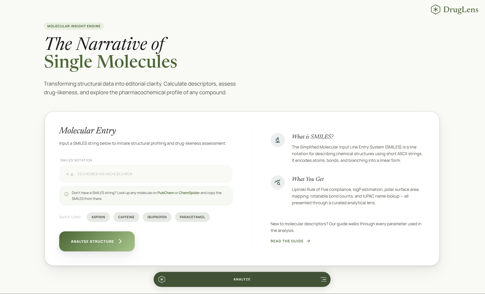

# DrugLens

A Flask-based cheminformatics web app for molecular descriptor calculation and drug-likeness analysis.



## Live Demo

https://druglens.onrender.com

## Motivation

As a biotechnology student interested in bioinformatics and computational biology, I built DrugLens to combine biological sciences with software development. The project aims to simplify molecular property analysis by providing an accessible platform for descriptor calculation, drug-likeness assessment, and cheminformatics exploration using RDKit and PubChem data.

## Features

- **Single Molecule Analysis** — input a SMILES string to calculate molecular descriptors and Lipinski Rule of Five compliance
- **2D Structure Visualisation** — RDKit-generated molecule images embedded inline
- **Molecular Descriptors** — Molecular Weight, LogP, H-Bond Donors/Acceptors, TPSA, Rotatable Bonds, Molecular Formula
- **IUPAC Name Lookup** — PubChem REST API integration
- **Canonical SMILES** — normalised via RDKit
- **Drug-likeness Verdict** — Lipinski Ro5 with per-rule pass/fail badges and interpretation
- **Bioavailability Score** — composite 0–1 score derived from Lipinski violations and key descriptor penalties
- **Rule-based Interpretation Engine** — plain-language verdict and flagged issues (high LogP, TPSA, MW)
- **Color-coded Descriptor Feedback** — per-descriptor Optimal / Borderline / Too High status badges
- **Molecule Comparison** — side-by-side analysis of two molecules with a unified descriptor table
- **CSV Export** — download full results including descriptors and Lipinski breakdown
- **Descriptor Guide** — reference page explaining each descriptor with thresholds and clinical context

## Tech Stack

- **Backend** — Python, Flask, RDKit
- **Frontend** — Jinja2 templates, Tailwind CSS (CDN), Newsreader + Manrope (Google Fonts)
- **Data** — PubChem REST API
- **Deployment** — Gunicorn, Render

## Project Structure

```
druglens/
├── app.py
├── requirements.txt
├── Procfile
├── runtime.txt
├── static/
│   └── css/
│       └── style.css
├── templates/
│   ├── base.html
│   ├── index.html
│   ├── result_rdkit.html
│   ├── compare.html
│   ├── compare_result.html
│   └── guide.html
└── utils/
    ├── descriptor_calc.py
    ├── drug_likeness.py
    ├── mol_image.py
    └── pubchem.py
```


